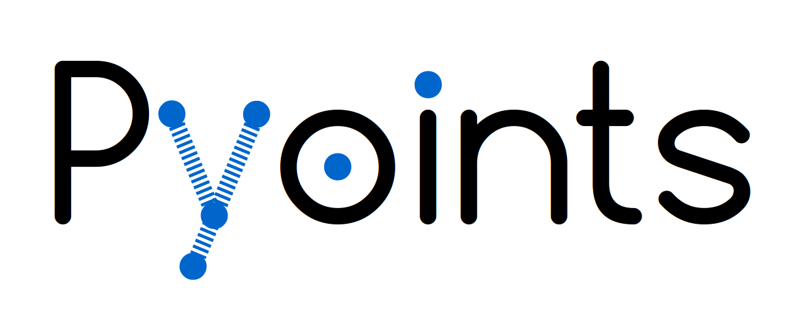

# Pyoints



``Pyoints`` is a python library to conveniently process and analyze point
cloud data, voxels and raster images. It is intended to be used to support
the development of advanced algorithms for geo-data processing.

## General concept

The key idea of ``Pyoints`` is to provide unified data structure to handle
points, voxels and rasters in the same manner. It is always assumed that the
data can be interpreted as a two or three dimensional point cloud. Thus we have
a collection of geo-objects (here called `GeoRecords`), which are characterized
by two or three dimensional coordinates *coords*, a spatial reference *proj*
and a transformation matrix *t*. The spatial reference and transformation
matrix are required to define the location of the geo-objects on globe. Next to
the origin, the transformation matrix also stores the scale and rotation of the
local coordinate system.

The unified data structures simplify the joint use of point clouds, voxels
and rasters significantly, while keeping their natural characteristics. To
ease the processing and analysis, each point, voxel or raster cell are stored 
in the commonly used numpy record array according to its natural structure. For
example, a three dimensional point cloud represents a set of points, each
characterized by a coordinate and none to many additional attributes. So the
points are stored in a one dimensional record array. On the other hand raster
images are stored in a two dimensional record array, which allows for the
commonly used index access of raster cells. Still each cell is characterized
by a coordinate and none to many additional attributes. Three dimensional
voxels are accordingly represented by three dimensional record arrays.

Since all objects of a voxel or raster are also interpreted as a point cloud,
spatial neighborhood queries, like nearest neighbours or distance search, can
be performed with unified functions. So, each extension of `GeoRecords`
provides a spatial index `IndexKD` to conveniently perform efficient
neighborhood queries. The class `IndexKD` is wrapper of different spatial
indices, to handle *k*-dimensional spatial queries of different kinds. The
spatial indices are always initialized on demand for performance reasions, but
cached for future queries. For example, an instance *geoRecords* of
`GeoRecords` representing three dimensional points allows to create a three
dimensional spatial index by calling `geoRecords.indexKD()`. If you are not
interrested in the third dimension, you can call `geoRecords.indexKD(2)` to
perform two dimensional spatial queries.

If you just want to handle coordinates without additional attributes, the class
`Coords` might interrest you. This class also provides the `IndexKD` feature, 
but waives the use of a projection and transformation matrix.


## When is Pyoints suitable for me?

Beased on the general concept of ``Pyoints`` presented above, a bunch of 
algorithms, functions and filters have been implemented, to process geo-data 
with low programming effords. 

Of course, you might think: "Why should I use python for point cloud 
processing? Other languages are much more efficient." This is obviously true, 
but in the experience of the author, Python is very useful to implement and
test new algorithms very quickly. Algorithms for point cloud analysis and
processing often rely on spatial neighborhood queries. Since ``Pyoints``
takes advantage of very efficient python libraries, which are basically
wrappers for binaries written in more efficient languages, the performance
loss is limited. Since ``Pyoints`` takes care of selecting and caching 
appropiate spatial indices for you, you can focus on the core of your algorithm
idea.

So, if you have an algorithm idea and you want to implemen it quickly and play
around with different settings, ``Pyoints`` is made for you. After finding an 
approiate algorithm it can be implemented in a more efficient language 
if you like. Thus ``Pyoints`` is particulary designed for scientists and 
developers of new geo-spatial algorithms.


# Installation (Ubuntu)

## Install external dependencies

Following dependencies have to be installed manually, since they are required
by the pip packages.

### Python

The ``Pyoints`` targets Python3 >= 3.5. The code should also compatible to
Python2 >= 2.7.


### Gdal

```
sudo apt install gdal-bin
sudo apt install libgdal-dev
```

### libspatialindex

```
apt install libspatialindex-dev
```

### Liblas

```
apt install liblas-c3
```


## Install Pyoints (Ubuntu)

Unfortunately the gdal version is not detected automatically by ``pgdal``. 
Thus, installation with ``setup.py`` might fail.

### Installation with installation script (currently recommended)

The installation script asks you to provide a virtual python environment
(virtualenv) . You need to initialize it first.
```
./pip_install.sh -v path/to/virtualenv
```

## Installation with pip

```
pip install pygdal==$(gdal-config --version).* -r requirements.txt --upgrade
```

### Installation from source

```
python setup.py build
python setup.py install
```

### Installation via pip (hopefully in future)

```
pip install pyoints
```


# Development

## Virtualenv

### Install Virtualenv 

Installation (Ubuntu)
```
apt install virtualenv
```

Initialize
```
cd /path/to/library
virtualenv venv
```

### Activate virtualenv

Linux
```
cd /path/to/library
. venv/bin/activate
```

Windows
```
cd path\to\library
venv\Scripts\activate.bat
```


# Documentation

You can find the documentation at [docs](docs/_build/html/pyoints.html). Here 
you can find docstrings with examples for each module and some comprehensive 
examples. You also can take a look at the source files directly.


# Testing

To test the software please take a look at the [tests](tests) directory. 
Currently python docstrings are used to test the the functionality of a 
mayority of ``Pyoints`` classes and functions.


# License

Copyright (c) 2018, Sebastian Lamprecht, Trier University, 
lamprecht@uni-trier.de

``Pyoints`` is free software made available under the GNU General Public 
License v3 or later (GPLv3+). See [LICENSE](LICENSE) for details.


# Contact

In case of questions, suggestions for improvement or software issues. Please 
use the issue board or contact Sebastian Lamprecht, lamprecht@uni-trier.de.
Contribution to the software is always welcome.


# Acknowledgements


## Python Depencencies

This software dynamically binds following python packages (distributed via 
pip). Many thanks to the authors for providing such great open source software.


### affine

Sean Gillies
* [PyPI](https://pypi.org/project/affine/)
* [homepage](https://github.com/sgillies/affine)
* [3-Clause BSD license](https://github.com/sgillies/affine/blob/master/LICENSE.txt)


### cylinder_fitting

Xingjie Pan
* [PyPI](https://pypi.org/project/cylinder_fitting/)
* [homepage](https://github.com/xingjiepan/cylinder_fitting)
* [3-Clause BSD license](https://github.com/xingjiepan/cylinder_fitting/blob/master/license.txt)


### dill

Mike McKerns
* [PyPI](https://pypi.org/project/dill/)
* [homepage](https://github.com/uqfoundation/dill)
* [3-Clause BSD license](https://github.com/uqfoundation/dill/blob/master/LICENSE)


### pygdal

Frank Warmerdam
* [PyPI](https://pypi.org/project/pygdal/)
* [homepage](https://github.com/nextgis/pygdal)
* [2-Clause BSD license](https://github.com/laspy/laspy/blob/master/LICENSE.txt)


### laspy

Grant Brown and Howard Butler
* [PyPI](https://pypi.org/project/laspy/)
* [homepage](https://github.com/laspy/laspy)
* [2-Clause BSD license](https://github.com/laspy/laspy/blob/master/LICENSE.txt)


### networkx

NetworkX Developers
* [PyPI](https://pypi.org/project/networkx/)
* [homepage](http://networkx.github.io/)
* [3-Clause BSD license](https://github.com/networkx/networkx/blob/master/LICENSE.txt)


### numpy

Travis E. Oliphant et al.
* [PyPI](https://pypi.org/project/numpy/)
* [homepage](http://www.numpy.org/)
* [3-Clause BSD license](http://www.numpy.org/license.html#license)


### opencv-python

Olli-Pekka Heinisuo
* [PyPI](https://pypi.org/project/opencv-python/)
* [homepage](https://github.com/skvark/opencv-python)
* [MIT license](https://github.com/opencv/opencv/blob/master/LICENSE)


### pandas

The PyData Development Team
* [PyPI](https://pypi.org/project/pandas/)
* [homepage](http://pandas.pydata.org/)
* [3-Clause BSD license](https://github.com/pandas-dev/pandas/blob/master/LICENSE)


### plyfile

Darsh Ranjan
* [PyPI](https://pypi.org/project/plyfile/https://pypi.org/project/plyfile/)
* [homepage](https://github.com/dranjan/python-plyfile)
* [GPL v3.0 (or later)](https://github.com/dranjan/python-plyfile/blob/master/COPYING)


### psycopg2-binary

Federico Di Gregorio
* [PyPI](https://pypi.org/project/psycopg2-binary/)
* [homepage](http://initd.org/psycopg/)
* [LGPL v3.0 (or later)](https://github.com/psycopg/psycopg2/blob/master/LICENSE)


### pyproj

Jeff Whitaker
* [PyPI](https://pypi.org/project/pyproj/)
* [homepage](https://github.com/jswhit/pyproj)
* [OSI approved license](https://github.com/jswhit/pyproj/blob/master/LICENSE)


### scikit-learn

Andreas Mueller
* [PyPI](https://pypi.org/project/scikit-learn/)
* [homepage](http://scikit-learn.org/stable/)
* [3-Clause BSD license](https://github.com/scikit-learn/scikit-learn/blob/master/COPYING)


### scipy

SciPy Developers
* [PyPI](https://pypi.org/project/scipy/)
* [homepage](https://www.scipy.org/)
* [3-Clause BSD license](https://github.com/scipy/scipy/blob/master/LICENSE.txt)


### rtree

Howard Butler
* [PyPI](https://pypi.org/project/Rtree/)
* [homepage](http://toblerity.org/rtree/)
* [LGPL v2.1 (or later)](https://github.com/Toblerity/rtree/blob/master/LICENSE.txt)


## External Depencencies

``Pyoints` binds following external libraries as required by some of the pip
packages.


### GDAL

Frank Warmerdam
* [homepage](https://www.gdal.org/)
* [X11/MIT license](https://trac.osgeo.org/gdal/wiki/FAQGeneral#WhatlicensedoesGDALOGRuse)


### Liblas

Howard Butler, Mateusz Loskot and others
* [homepage](https://liblas.org/)
* [X11/MIT license](https://liblas.org/copyright.html#license)


### libspatialindex

Marios Hadjieleftheriou
* [homepage](https://libspatialindex.github.io/)
* [MIT license](https://libspatialindex.github.io/)


## Software recommendations

Following python packages were used for software development, testing and 
documentation.


### autopep8

Hideo Hattori
* [PyPI](https://pypi.org/project/autopep8/)
* [homepage](https://github.com/hhatto/autopep8)
* [MIT compatible license](https://github.com/matplotlib/matplotlib/blob/master/LICENSE/LICENSE)


### CloudCompare

Daniel Girardeau-Montaut
* [homepage](https://www.danielgm.net/cc/)
* [GPL v2](https://github.com/CloudCompare/CloudCompare/blob/master/license.txt)


### matplotlib

John D. Hunter, Michael Droettboom
* [PyPI](https://pypi.org/project/matplotlib/)
* [homepage](https://matplotlib.org/)
* [BSD compatible license](https://github.com/matplotlib/matplotlib/blob/master/LICENSE/LICENSE)


### pycodestyle

Ian Lee
* [PyPI](https://pypi.org/project/pycodestyle/)
* [homepage](https://pycodestyle.readthedocs.io/en/latest/)
* [Expat license](https://pycodestyle.readthedocs.io/en/latest/index.html#license)


### Sphinx

Georg Brandl
* [PyPI](https://pypi.org/project/Sphinx/)
* [homepage](http://www.sphinx-doc.org/en/master/)
* [3-Clause BSD license](https://github.com/sphinx-doc/sphinx)


### sphinxcontrib-napoleon

Rob Ruana
* [PyPI](https://pypi.org/project/sphinxcontrib-napoleon/)
* [homepage](https://sphinxcontrib-napoleon.readthedocs.io/en/latest/)
* [2-Clause BSD license](https://github.com/sphinx-contrib/napoleon/blob/master/LICENSE)
